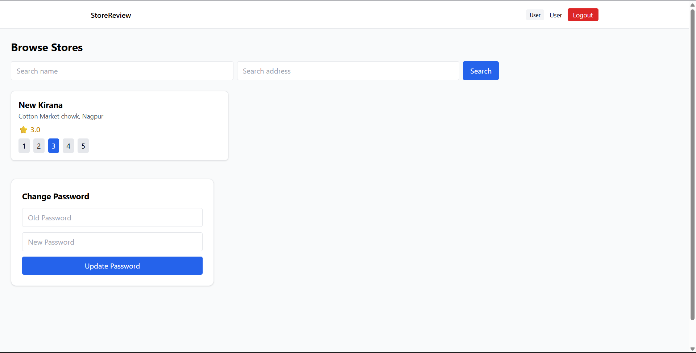
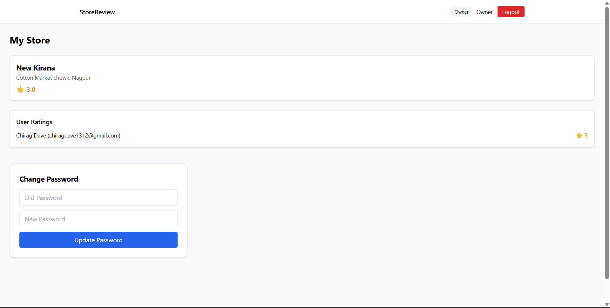
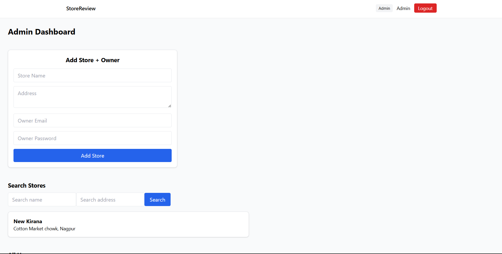
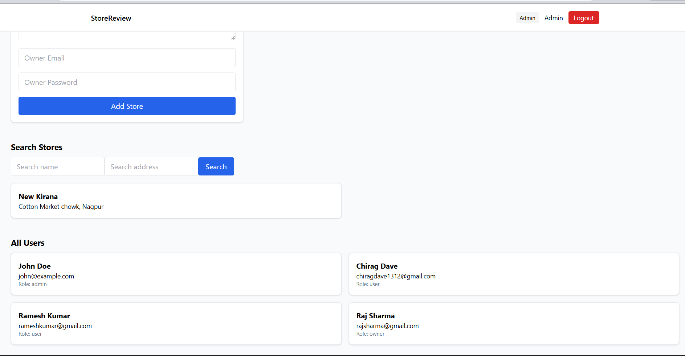
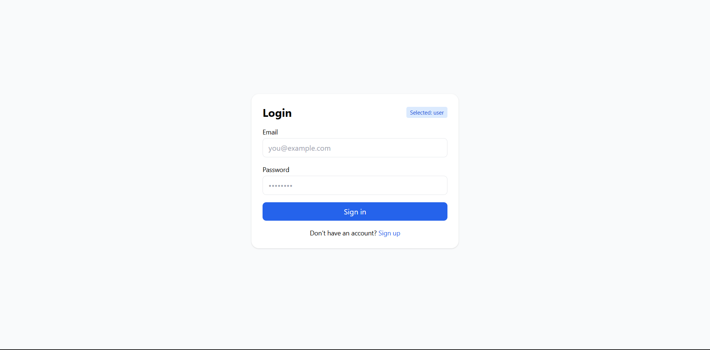
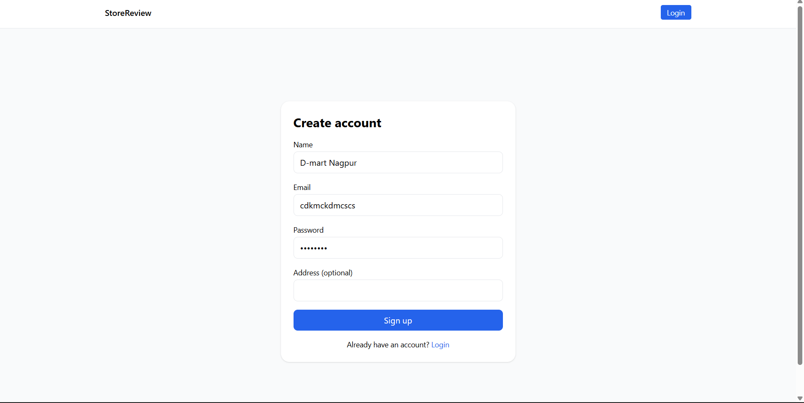
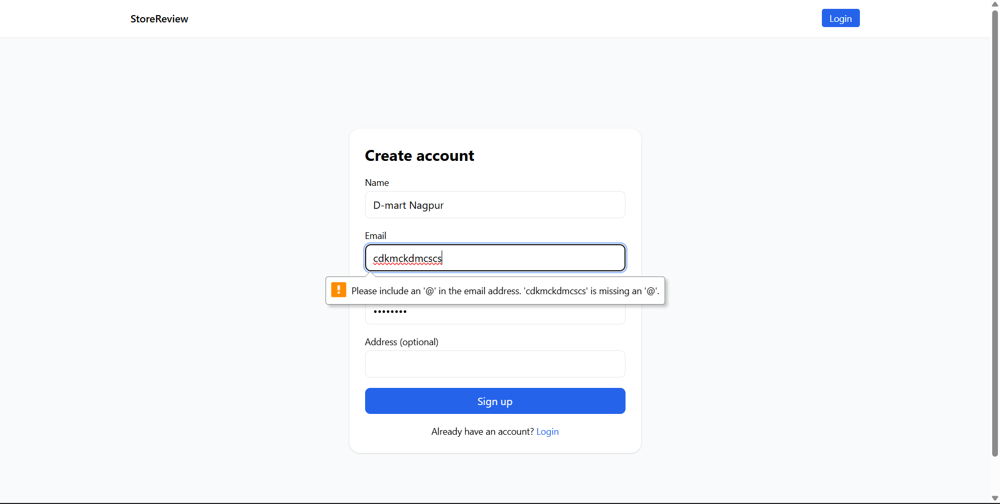
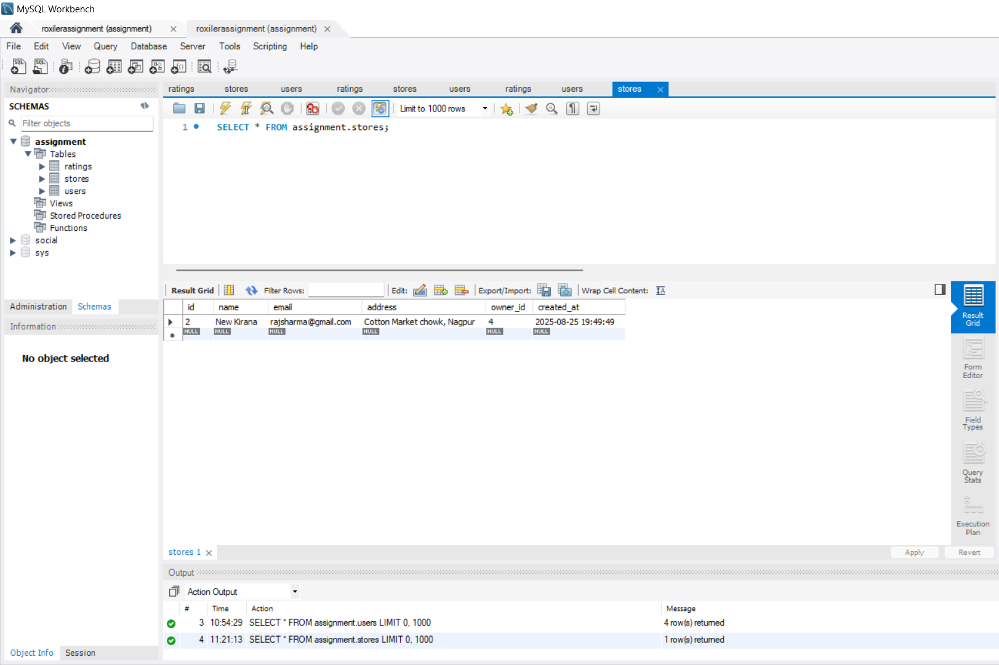
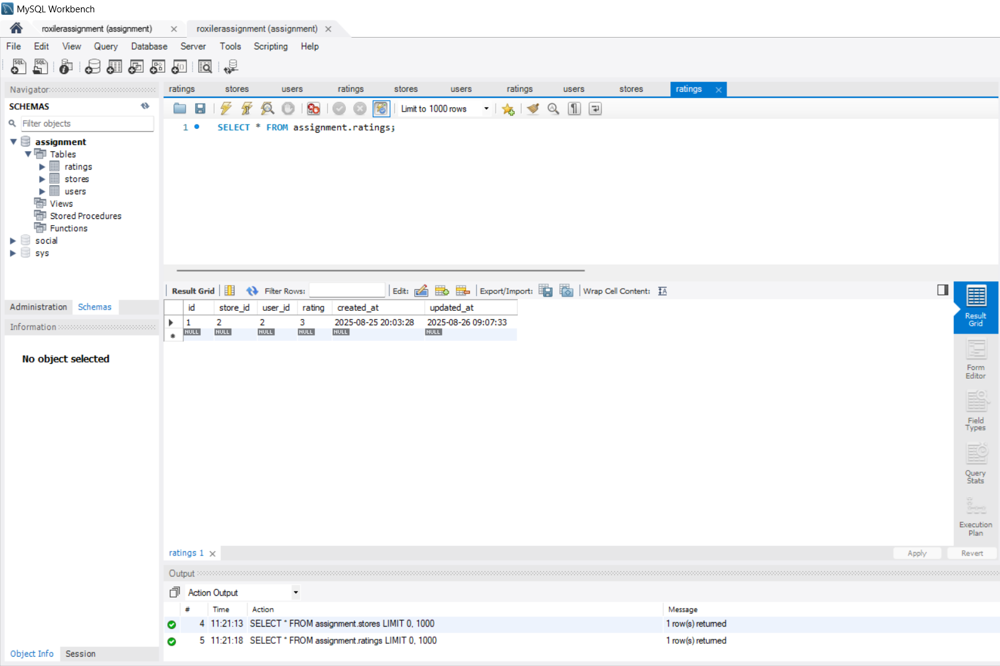

# 🏪 Store Rating & Review System  

[](https://react.dev/)  
[](https://nodejs.org/)  
[](https://expressjs.com/)  
[](https://www.mysql.com/)  

A **full-stack web application** that enables **users to rate stores**, **owners to manage their stores & ratings**, and **admins to manage the system**.  

## 🖼️ Screenshots

### 👤 User Dashboard


### 🏪 Store Owner Dashboard


### 🔑 Admin Dashboard



### 🔐 Landing Page


### 🔐 Login Page


### 📝 Signup Page



### 💾 Database Tables




---

## ✨ Features  

### 👤 User  
- Sign up / Login (JWT authentication).  
- Search & filter stores by name and address.  
- Rate stores (⭐ 1–5, with update support).  
- View average ratings for each store.  

### 🏪 Store Owner  
- Login to their dashboard.  
- View details of their store.  
- Monitor all ratings submitted by users.  
- Change account password securely.  

### 🔑 Admin  
- Dashboard with counts (users, stores, ratings).  
- Manage users (filter by name, email, role, address).  
- Add new stores & assign to owners.  
- Manage store listings with average ratings.  

---

## 🛠️ Tech Stack  

- **Frontend:** React (Vite), Axios, TailwindCSS, React Router  
- **Backend:** Node.js, Express.js, JWT Authentication  
- **Database:** MySQL (with bcrypt password hashing)  
- **Other Tools:** React Hot Toast, GitHub for version control  

---

## 🚀 Getting Started  

### 1️⃣ Clone the repository  
```bash
git clone https://github.com/your-username/roxiler-assignment.git
cd roxiler-assignment
